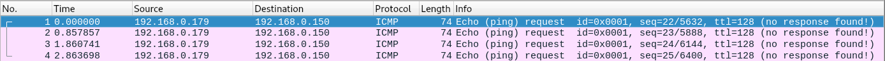

# Teaching-HEIGVD-SRX-2020-Laboratoire-IDS

Fichier modifié par : **Müller Robin et Teixeira Carvalho Stéphane**

**Ce travail de laboratoire est à faire en équipes de 2 personnes** (oui... en remote...). Je vous laisse vous débrouiller ;-)

**ATTENTION : Commencez par créer un Fork de ce repo et travaillez sur votre fork.**

Clonez le repo sur votre machine. Vous pouvez répondre aux questions en modifiant directement votre clone du README.md ou avec un fichier pdf que vous pourrez uploader sur votre fork.

**Le rendu consiste simplement à répondre à toutes les questions clairement identifiées dans le text avec la mention "Question" et à les accompagner avec des captures. Le rendu doit se faire par une "pull request". Envoyer également le hash du dernier commit et votre username GitHub par email au professeur et à l'assistant**

## Table de matières

[Introduction](#introduction)

[Echéance](#echéance)

[Configuration du réseau](#configuration-du-réseau-sur-virtualbox)

[Installation de Snort](#installation-de-snort-sur-linux)

[Essayer Snort](#essayer-snort)

[Utilisation comme IDS](#utilisation-comme-un-ids)

[Ecriture de règles](#ecriture-de-règles)

[Travail à effectuer](#exercises)


## Echéance

Ce travail devra être rendu le dimanche après la fin de la 2ème séance de laboratoire, soit au plus tard, **le 6 avril 2020, à 23h59.**


## Introduction

Dans ce travail de laboratoire, vous allez explorer un système de detection contre les intrusions (IDS) dont l'utilisation es très répandue grace au fait qu'il est gratuit et open source. Il s'appelle [Snort](https://www.snort.org). Il existe des versions de Snort pour Linux et pour Windows.

### Les systèmes de detection d'intrusion

Un IDS peut "écouter" tout le traffic de la partie du réseau où il est installé. Sur la base d'une liste de règles, il déclenche des actions sur des paquets qui correspondent à la description de la règle.

Un exemple de règle pourrait être, en language commun : "donner une alerte pour tous les paquets envoyés par le port http à un serveur web dans le réseau, qui contiennent le string 'cmd.exe'". En on peut trouver des règles très similaires dans les règles par défaut de Snort. Elles permettent de détecter, par exemple, si un attaquant essaie d'executer un shell de commandes sur un serveur Web tournant sur Windows. On verra plus tard à quoi ressemblent ces règles.

Snort est un IDS très puissant. Il est gratuit pour l'utilisation personnelle et en entreprise, où il est très utilisé aussi pour la simple raison qu'il est l'un des plus efficaces systèmes IDS.

Snort peut être exécuté comme un logiciel indépendant sur une machine ou comme un service qui tourne après chaque démarrage. Si vous voulez qu'il protège votre réseau, fonctionnant comme un IPS, il faudra l'installer "in-line" avec votre connexion Internet.

Par exemple, pour une petite entreprise avec un accès Internet avec un modem simple et un switch interconnectant une dizaine d'ordinateurs de bureau, il faudra utiliser une nouvelle machine executant Snort et placée entre le modem et le switch.


## Matériel

Vous avez besoin de votre ordinateur avec VirtualBox et une VM Kali Linux. Vous trouverez un fichier OVA pour la dernière version de Kali sur `//eistore1/cours/iict/Laboratoires/SRX/Kali` si vous en avez besoin.


## Configuration du réseau sur VirtualBox

Votre VM fonctionnera comme IDS pour "protéger" votre machine hôte (par exemple, si vous faites tourner VirtualBox sur une machine Windows, Snort sera utilisé pour capturer le trafic de Windows vers l'Internet).

Pour cela, il faudra configurer une réseau de la VM en mode "bridge" et activer l'option "Promiscuous Mode" dans les paramètres avancés de l'interface. Le mode bridge dans l'école ne vous permet pas d'accéder à l'Internet depuis votre VM. Vous pouvez donc rajouter une deuxième interface réseau à votre Kali configurée comme NAT. La connexion Internet est indispensable pour installer Snort mais pas vraiment nécessaire pour les manipulations du travail pratique.

Pour les captures avec Snort, assurez-vous de toujours indiquer la bonne interface dans la ligne de commandes, donc, l'interface configurée en mode promiscuous.


## Installation de Snort sur Linux

On va installer Snort sur Kali Linux. Si vous avez déjà une VM Kali, vous pouvez l'utiliser. Sinon, vous avez la possibilité de copier celle sur `eistore`.

La manière la plus simple c'est de d'installer Snort en ligne de commandes. Il suffit d'utiliser la commande suivante :

```
sudo apt update && apt install snort
```

Ceci télécharge et installe la version la plus récente de Snort.

Vers la fin de l'installation, on vous demande de fournir l'adresse de votre réseau HOME. Il s'agit du réseau que vous voulez protéger. Cela sert à configurer certaines variables pour Snort. Pour les manipulations de ce laboratoire, vous pouvez donner n'importe quelle adresse comme réponse.


## Essayer Snort

Une fois installé, vous pouvez lancer Snort comme un simple "sniffer". Pourtant, ceci capture tous les paquets, ce qui peut produire des fichiers de capture énormes si vous demandez de les journaliser. Il est beaucoup plus efficace d'utiliser des règles pour définir quel type de trafic est intéressant et laisser Snort ignorer le reste.

Snort se comporte de différentes manières en fonction des options que vous passez en ligne de commande au démarrage. Vous pouvez voir la grande liste d'options avec la commande suivante :

```
snort --help
```

On va commencer par observer tout simplement les entêtes des paquets IP utilisant la commande :

```
snort -v -i eth0
```

**ATTENTION : assurez-vous de bien choisir l'interface qui se trouve en mode bridge/promiscuous. Elle n'est peut-être pas eth0 chez-vous!**

Snort s'execute donc et montre sur l'écran tous les entêtes des paquets IP qui traversent l'interface eth0. Cette interface est connectée à l'interface réseau de votre machine hôte à travers le bridge de VirtualBox.

Pour arrêter Snort, il suffit d'utiliser `CTRL-C` (**attention** : il peut arriver de temps à autres que snort ne réponde pas correctement au signal d'arrêt. Dans ce cas-là, il faudra utiliser `kill` pour arrêter le process).

## Utilisation comme un IDS

Pour enregistrer seulement les alertes et pas tout le trafic, on execute Snort en mode IDS. Il faudra donc spécifier un fichier contenant des règles.

Il faut noter que `/etc/snort/snort.config` contient déjà des références aux fichiers de règles disponibles avec l'installation par défaut. Si on veut tester Snort avec des règles simples, on peut créer un fichier de config personnalisé (par exemple `mysnort.conf`) et importer un seul fichier de règles utilisant la directive "include".

Les fichiers de règles sont normalement stockes dans le repertoire `/etc/snort/rules/`, mais en fait un fichier de config et les fichiers de règles peuvent se trouver dans n'importe quel repertoire.

Par exemple, créez un fichier de config `mysnort.conf` dans le repertoire `/etc/snort` avec le contenu suivant :

```
include /etc/snort/rules/icmp2.rules
```

Ensuite, créez le fichier de règles `icmp2.rules` dans le repertoire `/etc/snort/rules/` et rajoutez dans ce fichier le contenu suivant :

`alert icmp any any -> any any (msg:"ICMP Packet"; sid:4000001; rev:3;)`

On peut maintenant executer la commande :

```
snort -c /etc/snort/mysnort.conf
```

Vous pouvez maintenant faire quelques pings depuis votre hôte et regarder les résultas dans le fichier d'alertes contenu dans le repertoire `/var/log/snort/`.


## Ecriture de règles

Snort permet l'écriture de règles qui décrivent des tentatives de exploitation de vulnérabilités bien connues. Les règles Snort prennent en charge à la fois, l'analyse de protocoles et la recherche et identification de contenu.

Il y a deux principes de base à respecter :

* Une règle doit être entièrement contenue dans une seule ligne
* Les règles sont divisées en deux sections logiques : (1) l'entête et (2) les options.

L'entête de la règle contient l'action de la règle, le protocole, les adresses source et destination, et les ports source et destination.

L'option contient des messages d'alerte et de l'information concernant les parties du paquet dont le contenu doit être analysé. Par exemple:

```
alert tcp any any -> 192.168.1.0/24 111 (content:"|00 01 86 a5|"; msg: "mountd access";)
```

Cette règle décrit une alerte générée quand Snort trouve un paquet avec tous les attributs suivants :

* C'est un paquet TCP
* Emis depuis n'importe quelle adresse et depuis n'importe quel port
* A destination du réseau identifié par l'adresse 192.168.1.0/24 sur le port 111

Le text jusqu'au premier parenthèse est l'entête de la règle.

```
alert tcp any any -> 192.168.1.0/24 111
```

Les parties entre parenthèses sont les options de la règle:

```
(content:"|00 01 86 a5|"; msg: "mountd access";)
```

Les options peuvent apparaître une ou plusieurs fois. Par exemple :

```
alert tcp any any -> any 21 (content:"site exec"; content:"%"; msg:"site
exec buffer overflow attempt";)
```

La clé "content" apparait deux fois parce que les deux strings qui doivent être détectés n'apparaissent pas concaténés dans le paquet mais à des endroits différents. Pour que la règle soit déclenchée, il faut que le paquet contienne **les deux strings** "site exec" et "%".

Les éléments dans les options d'une règle sont traitées comme un AND logique. La liste complète de règles sont traitées comme une succession de OR.

## Informations de base pour le règles

### Actions :

```
alert tcp any any -> any any (msg:"My Name!"; content:"Skon"; sid:1000001; rev:1;)
```

L'entête contient l'information qui décrit le "qui", le "où" et le "quoi" du paquet. Ça décrit aussi ce qui doit arriver quand un paquet correspond à tous les contenus dans la règle.

Le premier champ dans le règle c'est l'action. L'action dit à Snort ce qui doit être fait quand il trouve un paquet qui correspond à la règle. Il y a six actions :

* alert - générer une alerte et écrire le paquet dans le journal
* log - écrire le paquet dans le journal
* pass - ignorer le paquet
* drop - bloquer le paquet et l'ajouter au journal
* reject - bloquer le paquet, l'ajouter au journal et envoyer un `TCP reset` si le protocole est TCP ou un `ICMP port unreachable` si le protocole est UDP
* sdrop - bloquer le paquet sans écriture dans le journal

### Protocoles :

Le champ suivant c'est le protocole. Il y a trois protocoles IP qui peuvent être analysez par Snort : TCP, UDP et ICMP.


### Adresses IP :

La section suivante traite les adresses IP et les numéros de port. Le mot `any` peut être utilisé pour définir "n'import quelle adresse". On peut utiliser l'adresse d'une seule machine ou un block avec la notation CIDR.

Un opérateur de négation peut être appliqué aux adresses IP. Cet opérateur indique à Snort d'identifier toutes les adresses IP sauf celle indiquée. L'opérateur de négation est le `!`.

Par exemple, la règle du premier exemple peut être modifiée pour alerter pour le trafic dont l'origine est à l'extérieur du réseau :

```
alert tcp !192.168.1.0/24 any -> 192.168.1.0/24 111
(content: "|00 01 86 a5|"; msg: "external mountd access";)
```

### Numéros de Port :

Les ports peuvent être spécifiés de différentes manières, y-compris `any`, une définition numérique unique, une plage de ports ou une négation.

Les plages de ports utilisent l'opérateur `:`, qui peut être utilisé de différentes manières aussi :

```
log udp any any -> 192.168.1.0/24 1:1024
```

Journaliser le traffic UDP venant d'un port compris entre 1 et 1024.

--

```
log tcp any any -> 192.168.1.0/24 :6000
```

Journaliser le traffic TCP venant d'un port plus bas ou égal à 6000.

--

```
log tcp any :1024 -> 192.168.1.0/24 500:
```

Journaliser le traffic TCP venant d'un port privilégié (bien connu) plus grand ou égal à 500 mais jusqu'au port 1024.


### Opérateur de direction

L'opérateur de direction `->`indique l'orientation ou la "direction" du trafique.

Il y a aussi un opérateur bidirectionnel, indiqué avec le symbole `<>`, utile pour analyser les deux côtés de la conversation. Par exemple un échange telnet :

```
log 192.168.1.0/24 any <> 192.168.1.0/24 23
```

## Alertes et logs Snort

Si Snort détecte un paquet qui correspond à une règle, il envoie un message d'alerte ou il journalise le message. Les alertes peuvent être envoyées au syslog, journalisées dans un fichier text d'alertes ou affichées directement à l'écran.

Le système envoie **les alertes vers le syslog** et il peut en option envoyer **les paquets "offensifs" vers une structure de repertoires**.

Les alertes sont journalisées via syslog dans le fichier `/var/log/snort/alerts`. Toute alerte se trouvant dans ce fichier aura son paquet correspondant dans le même repertoire, mais sous le fichier `snort.log.xxxxxxxxxx` où `xxxxxxxxxx` est l'heure Unix du commencement du journal.

Avec la règle suivante :

```
alert tcp any any -> 192.168.1.0/24 111
(content:"|00 01 86 a5|"; msg: "mountd access";)
```

un message d'alerte est envoyé à syslog avec l'information "mountd access". Ce message est enregistré dans `/var/log/snort/alerts` et le vrai paquet responsable de l'alerte se trouvera dans un fichier dont le nom sera `/var/log/snort/snort.log.xxxxxxxxxx`.

Les fichiers log sont des fichiers binaires enregistrés en format pcap. Vous pouvez les ouvrir avec Wireshark ou les diriger directement sur la console avec la commande suivante :

```
tcpdump -r /var/log/snort/snort.log.xxxxxxxxxx
```

Vous pouvez aussi utiliser des captures Wireshark ou des fichiers snort.log.xxxxxxxxx comme source d'analyse por Snort.

## Exercises

**Réaliser des captures d'écran des exercices suivants et les ajouter à vos réponses.**

### Essayer de répondre à ces questions en quelques mots :

**Question 1: Qu'est ce que signifie les "preprocesseurs" dans le contexte de Snort ?**

---

Les préprocesseurs sont des plugins qui peuvent être utilisés afin d'examiner et de modifier des paquets avant l'engin de détection, l'IDS dans notre cas. Ceci permet de préparer les paquets afin qu'ils soient correctement interprétés par l'engin de détection.

Dans le cas de paquets chiffrés cela pourrait être intéressant. Nous pourrions déchiffrer le paquet avant de le transmettre à l'IDS par exemple.

Certains preprocesseurs permettent également d'examiner un paquet pour ainsi détecter les paquets qui pourrait tenter de bypass la détection de snort(ex. Frag3).

---

**Question 2: Pourquoi êtes vous confronté au WARNING suivant `"No preprocessors configured for policy 0"` lorsque vous exécutez la commande `snort` avec un fichier de règles ou de configuration "home-made" ?**

---

Parce que nous n'avons pas configuré de plugin préprocesseur pour le snort dans note fichier "home-made".

---

--

### Trouver votre nom :

Considérer la règle simple suivante:

alert tcp any any -> any any (msg:"Mon nom!"; content:"Rubinstein"; sid:4000015; rev:1;)

**Question 3: Qu'est-ce qu'elle fait la règle et comment ça fonctionne ?**

---
Cette règle permet de lancer une alerte lorsqu'un paquet tcp aura dans son contenu le mot-clé "Rubinstein".

Fonctionnement de la règle :

Cette règle va prendre tout les paquets tcp venant de n'importe quelle IP de n'importe quel port vers(`->`) n'importe quelle IP et port(règle mono-directionnelle).

Elle va lancer une alerte avec le message "mon nom!" (`msg:"Mon nom!";`) lorsque le paquet contient le mot-clé Rubinstein (`content:"Rubinstein";`). La règle a pour id unique 4000015 ce qui nous montre que c'est une règle rajouter par l'utilisateur qui est dans sa version 1. Nous pouvons affirmer cela car les 1'000'000 premières règles sont réserver aux règles de base de Snort.

---

Utiliser un éditeur et créer un fichier `myrules.rules` sur votre répertoire home. Rajouter une règle comme celle montrée avant mais avec votre nom ou un mot clé de votre préférence. Lancer snort avec la commande suivante :

```
sudo snort -c myrules.rules -i eth0
```

**Question 4: Que voyez-vous quand le logiciel est lancé ? Qu'est-ce que tous les messages affichés veulent dire ?**

---

```
Running in IDS mode

        --== Initializing Snort ==--
Initializing Output Plugins!
Initializing Preprocessors!
Initializing Plug-ins!
Parsing Rules file "myrules.rules"
Tagged Packet Limit: 256
Log directory = /var/log/snort
```
On voit tout d'abord l'initialisation de Snort qui initialise Les plugins et les preprocesseurs. Les rules sont parsées et le chemin du dossier de log est affiché.


```
+++++++++++++++++++++++++++++++++++++++++++++++++++
Initializing rule chains...
1 Snort rules read
    1 detection rules
    0 decoder rules
    0 preprocessor rules
1 Option Chains linked into 1 Chain Headers
0 Dynamic rules
+++++++++++++++++++++++++++++++++++++++++++++++++++

+-------------------[Rule Port Counts]---------------------------------------
|             tcp     udp    icmp      ip
|     src       0       0       0       0
|     dst       0       0       0       0
|     any       1       0       0       0
|      nc       0       0       0       0
|     s+d       0       0       0       0
+----------------------------------------------------------------------------

+-----------------------[detection-filter-config]------------------------------
| memory-cap : 1048576 bytes
+-----------------------[detection-filter-rules]-------------------------------
| none
-------------------------------------------------------------------------------

+-----------------------[rate-filter-config]-----------------------------------
| memory-cap : 1048576 bytes
+-----------------------[rate-filter-rules]------------------------------------
| none
-------------------------------------------------------------------------------

+-----------------------[event-filter-config]----------------------------------
| memory-cap : 1048576 bytes
+-----------------------[event-filter-global]----------------------------------
+-----------------------[event-filter-local]-----------------------------------
| none
+-----------------------[suppression]------------------------------------------
| none
-------------------------------------------------------------------------------
Rule application order: activation->dynamic->pass->drop->sdrop->reject->alert->log
Verifying Preprocessor Configurations!

[ Port Based Pattern Matching Memory ]
+-[AC-BNFA Search Info Summary]------------------------------
| Instances        : 1
| Patterns         : 1
| Pattern Chars    : 9
| Num States       : 9
| Num Match States : 1
| Memory           :   1.64Kbytes
|   Patterns       :   0.05K
|   Match Lists    :   0.10K
|   Transitions    :   1.10K
+-------------------------------------------------
pcap DAQ configured to passive.
Acquiring network traffic from "eth0".
Reload thread starting...
Reload thread started, thread 0x7f0450de1700 (3326)
Decoding Ethernet
```
On voit ensuite diverses informations sur les règles ainsi que la configuration.

```
        --== Initialization Complete ==--

   ,,_     -*> Snort! <*-
  o"  )~   Version 2.9.7.0 GRE (Build 149)
   ''''    By Martin Roesch & The Snort Team: http://www.snort.org/contact#team
           Copyright (C) 2014 Cisco and/or its affiliates. All rights reserved.
           Copyright (C) 1998-2013 Sourcefire, Inc., et al.
           Using libpcap version 1.8.1
           Using PCRE version: 8.39 2016-06-14
           Using ZLIB version: 1.2.11

Commencing packet processing (pid=3321)
WARNING: No preprocessors configured for policy 0.
```

L'initialisation de snort est terminée et l'analyse des paquets commence.


---

Aller à un site web contenant dans son text votre nom ou votre mot clé que vous avez choisi (il faudra chercher un peu pour trouver un site en http...).

**Question 5: Que voyez-vous sur votre terminal quand vous visitez le site ?**

---

Le terminal n'affiche rien de spécial il continue son exécution.

---

Arrêter Snort avec `CTRL-C`.

**Question 6: Que voyez-vous quand vous arrêtez snort ? Décrivez en détail toutes les informations qu'il vous fournit.**

---

```
===============================================================================
Run time for packet processing was 60.29478 seconds
Snort processed 22993 packets.
Snort ran for 0 days 0 hours 1 minutes 0 seconds
   Pkts/min:        22993
   Pkts/sec:          383
===============================================================================
Memory usage summary:
  Total non-mmapped bytes (arena):       2297856
  Bytes in mapped regions (hblkhd):      17252352
  Total allocated space (uordblks):      2073184
  Total free space (fordblks):           224672
  Topmost releasable block (keepcost):   67984
===============================================================================
Packet I/O Totals:
   Received:        23505
   Analyzed:        22993 ( 97.822%)
    Dropped:            0 (  0.000%)
   Filtered:            0 (  0.000%)
Outstanding:          512 (  2.178%)
   Injected:            0
===============================================================================
Breakdown by protocol (includes rebuilt packets):
        Eth:        22993 (100.000%)
       VLAN:            0 (  0.000%)
        IP4:        19020 ( 82.721%)
       Frag:            0 (  0.000%)
       ICMP:           21 (  0.091%)
        UDP:         5523 ( 24.020%)
        TCP:        12012 ( 52.242%)
        IP6:         3960 ( 17.223%)
    IP6 Ext:         3735 ( 16.244%)
   IP6 Opts:            0 (  0.000%)
      Frag6:            0 (  0.000%)
      ICMP6:            9 (  0.039%)
       UDP6:         2128 (  9.255%)
       TCP6:         1598 (  6.950%)
     Teredo:            0 (  0.000%)
    ICMP-IP:            1 (  0.004%)
    IP4/IP4:            0 (  0.000%)
    IP4/IP6:            0 (  0.000%)
    IP6/IP4:            0 (  0.000%)
    IP6/IP6:            0 (  0.000%)
        GRE:            0 (  0.000%)
    GRE Eth:            0 (  0.000%)
   GRE VLAN:            0 (  0.000%)
    GRE IP4:            0 (  0.000%)
    GRE IP6:            0 (  0.000%)
GRE IP6 Ext:            0 (  0.000%)
   GRE PPTP:            0 (  0.000%)
    GRE ARP:            0 (  0.000%)
    GRE IPX:            0 (  0.000%)
   GRE Loop:            0 (  0.000%)
       MPLS:            0 (  0.000%)
        ARP:           13 (  0.057%)
        IPX:            0 (  0.000%)
   Eth Loop:            0 (  0.000%)
   Eth Disc:            0 (  0.000%)
   IP4 Disc:         1464 (  6.367%)
   IP6 Disc:          225 (  0.979%)
   TCP Disc:            0 (  0.000%)
   UDP Disc:            0 (  0.000%)
  ICMP Disc:            0 (  0.000%)
All Discard:         1689 (  7.346%)
      Other:            0 (  0.000%)
Bad Chk Sum:          838 (  3.645%)
    Bad TTL:            0 (  0.000%)
     S5 G 1:            0 (  0.000%)
     S5 G 2:            0 (  0.000%)
      Total:        22993
===============================================================================
Action Stats:
     Alerts:            1 (  0.004%)
     Logged:            1 (  0.004%)
     Passed:            0 (  0.000%)
Limits:
      Match:            0
      Queue:            0
        Log:            0
      Event:            0
      Alert:            0
Verdicts:
      Allow:        22993 ( 97.822%)
      Block:            0 (  0.000%)
    Replace:            0 (  0.000%)
  Whitelist:            0 (  0.000%)
  Blacklist:            0 (  0.000%)
     Ignore:            0 (  0.000%)
      Retry:            0 (  0.000%)
===============================================================================
Snort exiting
```
Snort affiche un resumé de l'analyse lancée.

Dans la première partie, il est possible de voir pendant combien de temps Snort s'est exécuté.
Ensuite, les statistiques sur la mémoire utilisée par snort est affichées.

Puis, on peut voir le nombre de paquet que nous avons reçu et ceux analyser par Snort. Nous avons juste après la section qui indique le nombre de paquet analysés par protocol(protocol: nombre de paquets) ainsi que des statistiques sur les actions.

La dernière partie nous renseigne sur les alertes et les logs effectués par Snort dans notre cas on peut voir une alerte qui a étét lancée lorsque nous avons visité le site avec le mot-clé `Teixeira`.

---


Aller au répertoire /var/log/snort. Ouvrir le fichier `alert`. Vérifier qu'il y ait des alertes pour votre nom ou mot choisi.

**Question 7: A quoi ressemble l'alerte ? Qu'est-ce que chaque élément de l'alerte veut dire ? Décrivez-la en détail !**

---


La première ligne affiche le sid et la révision puis le message configuré par la règle.  
La seconde ligne contient la catégorie (`classType`) qui permet de grouper les règles afin de mieux les organiser.  
La troisième ligne est composée de la date et l'heure. On voit ensuite l'ip et le port source, la direction et l'ip et le port de destination.
Les lignes restantes contiennent des informations sur le paquet TCP ayant déclenché l'alerte.

---


--

### Detecter une visite à Wikipedia

Ecrire une règle qui journalise (sans alerter) un message à chaque fois que Wikipedia est visité **DEPUIS VOTRE** station. **Ne pas utiliser une règle qui détecte un string ou du contenu**.

**Question 8: Quelle est votre règle ? Où le message a-t'il été journalisé ? Qu'est-ce qui a été journalisé ?**

---

Notre règle est `log tcp 192.168.0.150 any -> 91.198.174.192 [80,443]`.

L'adresse source indiquer est l'adresse de la station que nous avons utilisé.  
L'adresse `91.198.174.192` est l'adresse que nous avons obtenu en effectuant un nslookup de www.wikipedia.org. Nous avons ensuite logger tout ce qui a pour destination le port 80 et 443(http et https).

Les messages ont été journalisés dans un fichier se nommant snort.log.XXXXXXXXXX dans le dossier `/var/log/snort`.

Ce qui a été journalisé c'est la communication du client avec le serveur wikipedia. Il est possible de voir le client qui s'annonce au serveur ainsi que le client qui envoie ses clés aux serveurs etc..


---

--

### Detecter un ping d'un autre système

Ecrire une règle qui alerte à chaque fois que votre système reçoit un ping depuis une autre machine (je sais que la situation actuelle du Covid-19 ne vous permet pas de vous mettre ensemble... utilisez votre imagination pour trouver la solution à cette question !). Assurez-vous que **ça n'alerte pas** quand c'est vous qui envoyez le ping vers un autre système !

**Question 9: Quelle est votre règle ?**

---

`alert icmp any any -> 192.168.0.150 any (itype: 8; msg:"ICMP Detected"; sid:4000016; rev:1;)`

Une alerte est généré lorsqu'un paquet icmp à pour destination `192.168.0.150`(machine hôte) et que le itype vaut 8. Un itype de 8 correspond à une icmp-request.

---


**Question 10: Comment avez-vous fait pour que ça identifie seulement les pings entrants ?**

---

Nous avons mis l'opérateur de direction `->` pour indiquer que nous voulons tout le trafic arrivant vers notre station.   

Nous avons également indiquer le paramètre `itype: 8` qui permet de spécifier que nous désirons alerter uniquement lors de echo request vers notre machine. Ainsi, si nous effectuons un ping depuis notre machine vers un autre système les echo reply que notre machine générera ne déclencheront pas d'alerte.

---


**Question 11: Où le message a-t-il été journalisé ?**

---

Le message est journaliser dans un fichier snort.log.XXXXXXXXXX ainsi que dans le fichier alert. Le fichier snort.log.XXXXXXXXXX (XXXXXXXXXX correspond au timestamp UNIX) est un PCAP des paquets de l'alerte. Il peut donc être lu par Wireshark

---


**Question 12: Qu'est-ce qui a été journalisé ?**

---

Dans le fichier alert il est possible de voir les informations suivantes :


On voit alors les 4 ECHO que notre machine à reçu.

Si nous désirons plus d'information sur les paquets que nous avons detecter il est possible d'aller voir dans le fichier de log dans ce cas nous pouvons voir les informations ci-dessous :



Grâce à cela il est possible de constater que les paquets reçu sont bien des echo-request.

---

--

### Detecter les ping dans les deux sens

Modifier votre règle pour que les pings soient détectés dans les deux sens.

**Question 13: Qu'est-ce que vous avez modifié pour que la règle détecte maintenant le trafic dans les deux senses ?**

---

Si nous voulons voir seulement les echo request il suffit de modifier l'opérateur de direction `->` par `<>` pour être bidirectionnel.  
`alert icmp any any <> 192.168.0.150 any (itype: 8; msg:"ICMP Detected"; sid:4000016; rev:1;)`


Dans la capture ci-dessus il est possible de constater que l'on voit les pings envoyés depuis notre station `192.168.0.150` vers un autre système. On détecte également les pings d'autres machines à destination de la nôtre.

Si nous voulons également voir les echo reply il faut enlever le itype: 8 de la règle.  
Ce qui donnerai la règle suivante :   
`alert icmp any any <> 192.168.0.150 any (msg:"ICMP Detected"; sid:4000016; rev:1;)`

---


--

### Detecter une tentative de login SSH

Essayer d'écrire une règle qui Alerte qu'une tentative de session SSH a été faite depuis la machine d'un voisin (je sais que la situation actuelle du Covid-19 ne vous permet pas de vous mettre ensemble... utilisez votre imagination pour trouver la solution à cette question !). Si vous avez besoin de plus d'information sur ce qui décrit cette tentative (adresses, ports, protocoles), servez-vous de Wireshark pour analyser les échanges lors de la requête de connexion depuis votre voisi.

**Question 14: Quelle est votre règle ? Montrer la règle et expliquer en détail comment elle fonctionne.**

---
Voici la règle que nous avons définie :  
`alert tcp any any -> 192.168.0.199 22 (msg:"SSH connection detected"; content:"SSH-"; nocase; sid:4000017; rev:1;)`

Voici la décomposition de la commande :

Si notre machine hôte(`192.168.0.199`) reçoit un paquet TCP sur le port 22 de n'importe quel machine(any any) contenant dans son paquet le mot clé "SSH-", un message d'alerte "SSH connection detetected" est enregistré par Snort.

L'attribut nocase permet de définir que le mot-clé peut-être trouver en miniscule ou majuscule. Nous avons également défini un sid et un numéro de révision.

Nous avons défini le mot-clé "SSH-" après avoir fais certaines recherches. Voici notre démarche :

 Nous avons tenté une connexion ssh sur la machine hôte tout en capturant le traffic avec Wireshark.  
 Nous avons ensuite effectué une recherche des paquets TCP sur le port 22.  
 Puis, nous avons regarder le stream TCP et avons obtenu le résultat suivant :


Nous avons alors remarqué que le paquet tcp avec pour contenu `SSH-...` était le premier paquet du stream donc le premier paquet reçu lors d'une tentative d'établissement de connexion SSH. Nous devons alors lancer une alerte dès que ce paquet avec ce contenu est reçu.

---


**Question 15: Montrer le message d'alerte enregistré dans le fichier d'alertes.**

---


Comme espéré, nous avons bien les 2 messages d'alerts qui représente les 2 premiers messages d'une connexion SSH(voir image Wireshark Question 14).

---

--

### Analyse de logs

Lancer Wireshark et faire une capture du trafic sur l'interface connectée au bridge. Générez du trafic avec votre machine hôte qui corresponde à l'une des règles que vous avez ajouté à votre fichier de configuration personnel. Arrêtez la capture et enregistrez-la dans un fichier.

**Question 16: Quelle est l'option de Snort qui permet d'analyser un fichier pcap ou un fichier log ?**

---

`snort -c myrules.rules -r ./Documents/captureQuestion16.pcapng`

Voici le résultat final au niveau des alertes après la lecture du fichier.


On voit 8 alertes car lors de la capture nous avons effectués 2 ping en direction de la machine hôte.


---

Utiliser l'option correcte de Snort pour analyser le fichier de capture Wireshark.

**Question 17: Quelle est le comportement de Snort avec un fichier de capture ? Y-a-t'il une difference par rapport à l'analyse en temps réel ?**

---

Le comportement reste identique sauf que à la place d'écouter le trafic il lit le fichier. Le fichier alert est modifié si des alertes sont détectées et le fichier de log snort est également créer après la lecture.

La seule différence pourrait venir du fait que Snort s'arrête après la lecture du fichier alors que dans le mode temps réel nous devons le désactiver à la main

---

**Question 18: Est-ce que des alertes sont aussi enregistrées dans le fichier d'alertes?**

---

Oui comme il est possible de le voir ci-dessous avec la capture d'écran.


Nous avons effectué 2 ping en direction de la machine hôte et on voit donc les 8 echo-request que la machine a reçue.

---

--

### Contournement de la détection

Faire des recherches à propos des outils `fragroute` et `fragtest`.

**Question 20: A quoi servent ces deux outils ?**

---

Ces deux outils sont utilisés pour modifier le traffic sortant dans le but d'évader la détection d'un NIDS. Ces outils sont uniquement capables de modifier le traffic sortant à destination d'un NIDS.

D'autres outils, tel que fragrouter, permettent de travailler sur tout le traffic réseau en utilisant du forwarding.

---


**Question 21: Quel est le principe de fonctionnement ?**

---

Ces outils travaillent principalement en fragmentant les paquets. Ils sont ensuite capables de dupliquer, dropper, réordonner les segments.  
Une autre technique utilise le réassemblage de fragments (fragmentation overlap). Cela consiste à remplacer certains fragments par les plus récents ou les plus anciens lors du réassemblage.

Ces différentes techniques peuvent être utilisées pour évader la détection.

---


**Question 22: Qu'est-ce que le `Frag3 Preprocessor` ? A quoi ça sert et comment ça fonctionne ?**

---

Frag3 est un préprocesseur utilisé pour défragmenter les paquets au niveau IP. Ceci permet d'améliorer grandement l'analyse ainsi que d'empêcher certaines techniques d'évasions.

Frag3 réassemble donc les paquets à sa manière afin de ne pas dépendre de l'environnement (p.ex. OS).

---


Reprendre l'exercice de la partie [Trouver votre nom](#trouver-votre-nom-). Essayer d'offusquer la détection avec `fragroute`.


**Question 23: Quel est le résultat de votre tentative ?**

---

<<<<<<< HEAD
Pour cette tentative, nous n'avons initialement obtenu aucun résultat pour offusquer le paquet.
=======
Pour cette tentative, nous n'avons initialement obtenu aucun résultat pour offusquer le paquet.  
Nous avons essayé plusieurs configuration de fragroute mais nous pensions que la règle `ip_frag 8` suffirait.  
>>>>>>> 3c9e5daf74f44f414f824761b0d00c605cb97201

Nous pensons que cela vient du fait qu'il est impossible de fragmenter la réponse du serveur web avec fragroute. Il est uniquement possible d'intéragir avec les paquets provenant de la machine locale vers le serveur web mais pas dans l'autre sens.  
Une solution possible serait d'utiliser fragrouter afin d'intéragir sur tous les paquets.

Afin de quand même tester le fonctionnement, nous avons configuré un serveur web (sur une seconde VM) avec un fichier contenant `Nom nom est Teixeira` ainsi que l'outil fragroute.  
Nous avons ensuite lancé `sudo fragroute -f frag.conf 192.168.199.102` afin de fragmenter les paquets à la destination de notre machine hôte.  
Nous avons ensuite lancé snort ainsi que 5 fois la commande `wget` pour télécharger la page web.

Le résultat est le suivant :
```
===============================================================================
Action Stats:
     Alerts:            0 (  0.000%)
     Logged:            0 (  0.000%)
     Passed:            0 (  0.000%)
Limits:
      Match:            0
      Queue:            0
        Log:            0
      Event:            0
      Alert:            0
Verdicts:
      Allow:          256 ( 99.225%)
      Block:            0 (  0.000%)
    Replace:            0 (  0.000%)
  Whitelist:            0 (  0.000%)
  Blacklist:            0 (  0.000%)
     Ignore:            0 (  0.000%)
      Retry:            0 (  0.000%)
===============================================================================
```

L'alerte n'est donc plus affichée car le nom n'apparait pas dans un paquet unique.

---


Modifier le fichier `myrules.rules` pour que snort utiliser le `Frag3 Preprocessor` et refaire la tentative.


**Question 24: Quel est le résultat ?**

---

Pour mettre en place frag3 nous avons ajoutée dans le fichier `myrules.rules` les lignes suivantes :
```
preprocessor frag3_global
preprocessor frag3_engine
```

Nous avons ensuite suivi la même méthodologie et le résultat de snort est le suivant :
```
===============================================================================
Action Stats:
     Alerts:            5 (  2.101%)
     Logged:            5 (  2.101%)
     Passed:            0 (  0.000%)
Limits:
      Match:            0
      Queue:            0
        Log:            0
      Event:            0
      Alert:            0
Verdicts:
      Allow:          233 (100.000%)
      Block:            0 (  0.000%)
    Replace:            0 (  0.000%)
  Whitelist:            0 (  0.000%)
  Blacklist:            0 (  0.000%)
     Ignore:            0 (  0.000%)
      Retry:            0 (  0.000%)
===============================================================================
Frag3 statistics:
        Total Fragments: 170
      Frags Reassembled: 5
               Discards: 0
          Memory Faults: 0
               Timeouts: 0
               Overlaps: 0
              Anomalies: 0
                 Alerts: 0
                  Drops: 0
     FragTrackers Added: 5
    FragTrackers Dumped: 5
FragTrackers Auto Freed: 0
    Frag Nodes Inserted: 170
     Frag Nodes Deleted: 170
===============================================================================
```
Frag3 a donc été capable de réassembler les 5 paquets et donc de retrouver le nom.

---


**Question 25: A quoi sert le `SSL/TLS Preprocessor` ?**

---

Ce préprocesseur est utiisé pour décoder le traffic SSL et TLS. Comme ce processus est coûteux, il détermine également si et quand snort doit arrêter l'inspection.

Généralement, seul le handshake SSL est inspecté puis une fois completé, l'inspection est arrêtée car le traffic est chiffré.

---


**Question 26: A quoi sert le `Sensitive Data Preprocessor` ?**

---

Ce module détecte et filtre les informations sur les PII (données à caractère personnel). Il filtre donc les cartes de crédits, emails, adresses, etc.

---

### Conclusions


**Question 27: Donnez-nous vos conclusions et votre opinion à propos de snort**

---

Pour conclure, nous avons trouvé ce laboratoire intéressant malgré quelques problèmes de mise en place.  
Il était intéressant de voir la mise en pratique d'un IDS aini que de mettre en place des régles d'alerte et de logs.

Les points que nous avons un peu moins apprécié sont le fait que nous avons, tout d'abord, rencontré un problème d'installation de Snort sur la machine Kali qui nous a bloqué pendant un moment.  
Puis, nous avons eu à nouveau un problème avec la mise en place de fragroute.  
Le problème était que la commande ne trouvait pas de route pour attendre l'adresse ip de la machine hôte.
Nous avons longement cherché une réponse sur internet mais la commande fragroute semble avoir peu de documentation.  
Nous avons finalement trouvé une solution il fallait effectuer un ping vers la machine de destination pour ensuite pouvoir lancé frageroute et nous ne comprenons pas pourquoi cela règle le problème.

Mais dans l'ensemble le labo s'est bien déroulé.

Nous pensons que Snort est une application intéressante car sa mise en place est simple et il est facile de créer des règles. Ainsi, il serait simple pour une entreprise ou un privé de mettre en place son propre IDS.

---


<sub>This guide draws heavily on http://cs.mvnu.edu/twiki/bin/view/Main/CisLab82014</sub>
